# MySQL条件查询

# 补充：Navicat软件的使用

第一步：打开Linux操作系统，使用`sudo vim`编辑mysql的配置文件

```powershell
$ sudo vim /etc/mysql/mysql.conf.d/mysqld.cnf
打开以后搜索(输入/)，搜索bind-address，设置如下：
bind-address = 0.0.0.0

说明：0.0.0.0代表没有任何限制，所有主机均可连接这个MySQL软件
```

第二步：使用MySQL客户端登录MySQL，然后创建一个账号`root@%`，设置所有权限（管理员）

```powershell
$ mysql -uroot -p
Enter password: mysql

mysql> grant all on *.* to 'root'@'%' identified by 'mysql';
mysql> -- 刷新权限（--空格代表注释）
mysql> flush privileges;

grant ：分配权限
all ：所有权限
on ：给哪个数据库的哪个数据表设置权限
*.* ：数据库.数据表，*.*代表所有数据库的所有数据表（管理员）
to ：给哪个账号设置权限
'root'@'%' ：代表创建了一个root账号，然后所有机器均可连接这个账号
identified by 'mysql' ：设置root账号的密码为‘mysql'
```

第三步：重启mysql服务器

```powershell
退出mysql，然后再终端中执行
$ systemctl restart mysql
```

第四步：使用navicat软件对mysql进行连接

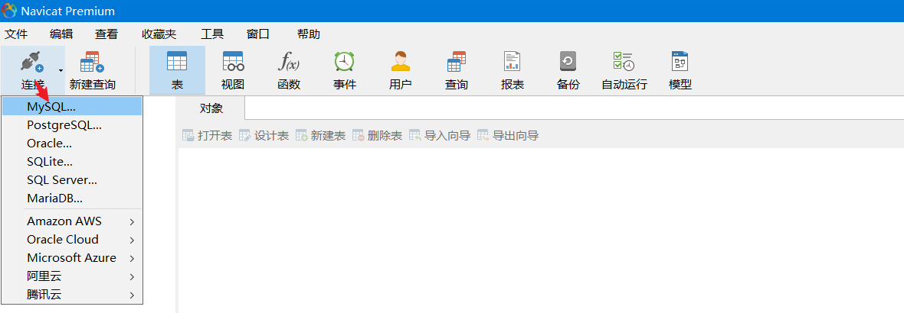

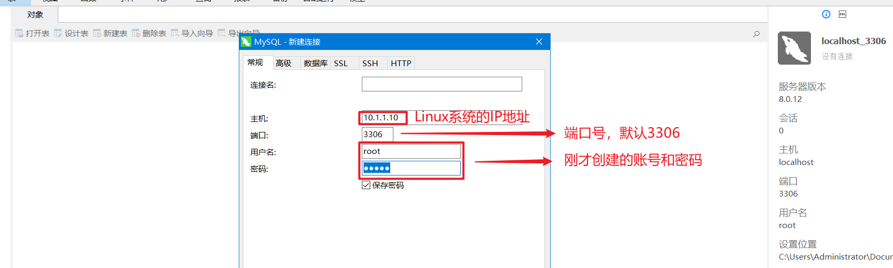

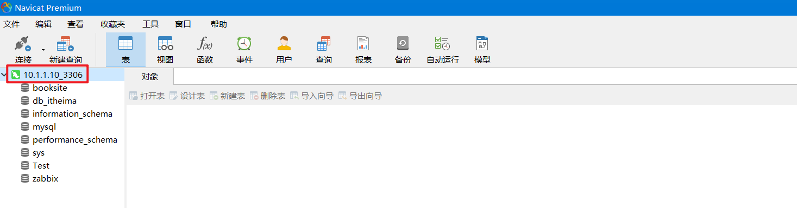

# ☆ as和distinct关键字

## 1、as关键字

主要功能：给我们的数据表或者数据表中字段，起别名。

```powershell
mysql> select * from 数据表;
```

但是如果我们只想查询某些字段，可以使用这样的方式：

```powershell
mysql> select 字段名称1, 字段名称2, ... from 数据表;
```

案例1：只查询tb_student表中的id/name/age这3个字段

```powershell
mysql> select id, name, age from tb_student;
```

案例2：只查询tb_student表中的name, mobile, address字段，但是希望显示时，name => n，mobile => m，address => a

```powershell
mysql> select name as n, mobile as m, address as a from tb_student;
```

## 2、distinct对字段进行去重操作

```powershell
mysql> select distinct 字段名称 from 数据表;
```

案例：查询tb_student学生表中，学员年龄的分布

```powershell
mysql> insert into tb_student values (2, '小美', 18, '13575009999', '北京市海淀区');
mysql> insert into tb_student values (3, '小强', 22, '13575009999', '深圳市宝安区');
mysql> insert into tb_student values (4, '小红', 18, '13575009999', '长沙市天心区');
```

```powershell
mysql> select distinct age from tb_student;
```

# ☆ where条件查询

## 1、基本语法

```powershell
mysql> select *或者字段列表 from 数据表 [where 查询条件];

满足where条件的就显示
不满足where条件的就忽略
```

## 2、where后面可以跟的内容

① 比较运算符

② 逻辑运算符

③ 模糊查询

④ 范围查询

⑤ 空判断

## 3、比较运算符

1.等于: =

2.大于: >

3.大于等于: >=

4.小于: <

5.小于等于: <=

6.不等于: != 或 <>


案例1：查询姓名为'小强'的学员信息

```powershell
mysql> select * from tb_student where name='小强';
```

案例2：查询年龄小于19岁的所有学员信息

```powershell
mysql> select * from tb_student where age < 19;
```

案例3：查询姓名不为小明的所有学员信息

```powershell
mysql> select * from tb_student where name != '小明';
或
mysql> select * from tb_student where name <> '小明';
```

## 4、逻辑运算符

1.and

2.or

3.not

案例1：查询年龄为18岁且姓名为小红的学员信息

```powershell
mysql> select * from tb_student where age = 18 and name='小红';
```


案例2：查询id = 1或id = 3或id = 5的所有学员

```powershell
mysql> select * from tb_student where id = 1 or id = 3 or id = 5;
```

扩展：in语句，在实际工作中，可能同时查询多个满足条件的结果，除了使用or还可以使用in关键字

```powershell
mysql> select * from tb_student where id in (1, 3, 5);
```


案例3：not，取反，查询id不等于1,3,5的所有学员信息

```powershell
mysql> select * from tb_student where id not in (1, 3, 5);
```


# 一、where条件查询

## 1、模糊查询

① like是模糊查询关键字

② %表示任意==多个==任意字符

③ _表示==一个==任意字符

**例1：查询姓黄的学生:**

```sql
select * from students where name like '黄%';
```

**例2：查询姓黄并且“名”是一个字的学生:**

```sql
select * from students where name like '黄_';
```

**例3：查询姓黄或叫靖的学生:**

```sql
select * from students where name like '黄%' or name like '%靖';
```

## 2、范围查询

① between .. and .. 表示在一个连续的范围内查询

② in 表示在一个非连续的范围内查询

**例1：查询编号为3至8的学生:**

```sql
select * from students where id between 3 and 8;
```

**例2：查询编号不是3至8的男生:**

```
select * from students where (not id between 3 and 8) and gender='男';
```

## 3、空判断查询（特殊）

① 判断为空使用: is null

② 判断非空使用: is not null

**例1：查询没有填写身高的学生:**

```sql
select * from students where height is null;
```

**注意:**

① 不能使用 where height = null 判断为空

② 不能使用 where height != null 判断非空

③ null 不等于 '' 空字符串

## 4、小结

- 常见的比较运算符有 >,<,>=,<=,!=
- 逻辑运算符and表示多个条件同时成立则为真，or表示多个条件有一个成立则为真，not表示对条件取反
- like和%百分号结合使用表示任意多个任意字符，like和_结合使用表示一个任意字符
- between...and...限制连续性范围 in限制非连续性范围
- 判断为空使用: is null
- 判断非空使用: is not null

# 二、order by排序查询

## 1、排序查询语法

排序查询语法：

```sql
select * from 表名 order by 列1 asc|desc [,列2 asc|desc,...]
```

**语法说明:**

1. 先按照列1进行排序，如果列1的值相同时，则按照 列2 排序，以此类推
2. asc从小到大排列，即升序（默认）
3. desc从大到小排序，即降序
4. 默认按照列值从小到大排序（即asc关键字）

**例1：查询男生信息，按学号降序:**

```sql
select * from students where gender='male' order by id desc;
```

**例2：显示所有的学生信息，先按照年龄从大-->小排序，当年龄相同时 按照身高从高-->矮排序:**

```sql
select * from students  order by age desc,height desc;
```

欧阳峰   50     height:1.85

黄药师   50	  height:1.82

## 2、小结

① 排序使用 order by 关键字

② asc 表示升序

③ desc 表示降序

# 三、limit分页查询

limit关键字在MySQL中，主要用于==限制查询结果返回的数量==。

## 1、分页查询的介绍

当我们在京东购物，浏览商品列表的时候，由于数据特别多，一页显示不完，一页一页的进行显示，这就是分页查询

## 2、分页查询的语法

```sql
select * from 表名 limit start,count
```

**说明:**

1. limit是分页查询关键字
2. start表示开始行索引，默认是0
3. count表示查询条数

**例1：查询前3行男生信息:**

```sql
select * from students where gender=1 limit 0,3;
简写
select * from students where gender=1 limit 3;
```

## 3、分页查询案例

比如有10条记录，每页显示2条，共分5页

比如有10条记录，每页显示4条，共分3页


0 1 2 3 4 5 6 7 8 9

第1页：显示0和1

第2页：显示2和3

第3页：显示4和5

...

第5页：显示8和9

以上分页功能可以简化为如下公式：pagesize = 2    总数量 count = 10  一共分5页

第1页：select * from students limit (1-1) * pagesize, pagesize      limit  0,2

第2页：select * from students limit (2-1) * pagesize, pagesize       limit 2,2

第3页：select * from students limit (3-1) * pagesize, pagesize       limit 4,2

已知每页显示pagesize条数据，求第n页显示的数据

提示: 关键是求每页的开始行索引

**查询学生表，获取第n页数据的SQL语句:**

```sql
select * from students limit (n-1)*pagesize,pagesize
```

> 看到分页就必须相当分页的公式limit 第一个参数=(当前页的页码 - 1) * 每页显示的数量，第二个参数就是每页显示的数量。

扩展：10000条记录，每页显示10条，一共分1000页

问：第999页的SQL语句如何写

```powershell
select * from student limit (999-1)*10,10;
```

## 4、小结

- 使用 limit 关键字可以限制数据显示数量，通过 limit 关键可以完成分页查询
- limit 关键字后面的第一个参数是开始行索引(默认是0，不写就是0)，第二个参数是查询条数

## 5、扩展：MySQL五子句

```powershell
select * from 数据表 where 子句 group by 分组子句 having 子句 order by 子句 limit 子句;

where
group by
having
order by
limit
合称MySQL五子句，五子句顺序不能颠倒。
```

案例：查询学生表中，性别为男且年龄最大的3个同学信息

```powershell
select * from students where gender='male' order by age desc limit 3;
```

# 四、聚合函数

## 1、 聚合函数的介绍

聚合函数又叫组函数，通常是对表中的数据进行统计和计算，一般结合分组(group by)来使用，用于统计和计算分组数据。

**常用的聚合函数:**

1. count(col): 表示求指定列的==总行数==
2. max(col): 表示求指定列的==最大值==
3. min(col): 表示求指定列的==最小值==
4. sum(col): 表示求指定列的==和==
5. avg(col): 表示求指定列的==平均值==

## 2、求总行数

```sql
-- 返回非NULL数据的总行数.
select count(name) from students; 
-- 返回总行数，包含null值记录;
select count(*) from students;
```

## 3、求最大值

```sql
-- 查询女生的年龄最大值
select max(age) from students where gender='female';
```

## 4、求最小值

```sql
-- 查询未删除的学生最小编号
select min(score) from grade where is_delete = 0;
```

## 5、求和

```sql
-- 查询男生的总成绩
select sum(score) from students where subject = 'python';
-- python所有学员平均成绩
select sum(score) / count(*) from students where subject = 'python';
```

## 6、求平均值

```sql
-- 求男生的平均成绩, 聚合函数不统计null值，平均成绩有误
select avg(score) from students where gender = 'male';
-- 求男生的平均成绩, 包含身高是null的
select avg(ifnull(score,0)) from students where gender = 'male';

ifnull(score, 0)：当score列某个值为null时，使用0代替null
```

**说明**

- ifnull函数: 表示判断指定字段的值是否为null，如果为空使用自己提供的值。
- ifnull(字段名称, 默认值)：如果这个字段为null，系统会自动将其设置为0（查询）

## 7、聚合函数的特点

- 聚合函数默认忽略字段为null的记录 要想列值为null的记录也参与计算，必须使用ifnull函数对null值做替换。

## 8、小结

- count(col): 表示求指定列的总行数
- max(col): 表示求指定列的最大值
- min(col): 表示求指定列的最小值
- sum(col): 表示求指定列的和
- avg(col): 表示求指定列的平均值

# 五、分组查询

## 1、分组查询介绍

分组查询就是将查询结果按照指定字段进行分组，字段中数据相等的分为一组。

**分组查询基本的语法格式如下：**

GROUP BY 列名 [HAVING 条件表达式] [WITH ROLLUP]

**说明:**

- 列名: 是指按照指定字段的值进行分组。
- HAVING 条件表达式: 用来过滤分组后的数据。
- WITH ROLLUP：在所有记录的最后加上一条记录，显示select查询时聚合函数的统计和计算结果

## 2、group by的使用

group by可用于单个字段分组，也可用于多个字段分组

```sql
-- 根据gender字段来分组
select gender from students group by gender;
-- 根据name和gender字段进行分组
select name, gender from students group by name, gender;
```

① group by可以实现去重操作

② group by的作用是为了实现分组统计（group by + 聚合函数）

## 3、group by + group_concat()的使用

group_concat(字段名): 统计每个分组指定字段的信息集合，每个信息之间使用逗号进行分割

```sql
-- 根据gender字段进行分组， 查询gender字段和分组的name字段信息
select gender,group_concat(name) from students group by gender;
```

## 4、group by + 聚合函数的使用

```sql
-- 统计不同性别的人的平均年龄
select gender,avg(age) from students group by gender;
-- 统计不同性别的人的个数
select gender,count(*) from students group by gender;
```

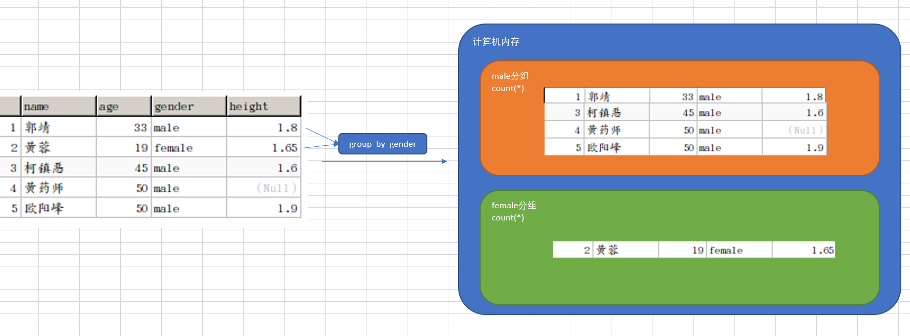

## 5、group by + having的使用

having作用和where类似都是过滤数据的，但having是过滤分组数据的，只能用于group by

```sql
-- 根据gender字段进行分组，统计分组条数大于2的
select gender,count(*) from students group by gender having count(*)>2;
```

## 6、group by + with rollup的使用（回溯统计）

with rollup的作用是：在最后记录后面新增一行，显示select查询时聚合函数的统计和计算结果

```sql
-- 根据gender字段进行分组，汇总总人数
select gender,count(*) from students group by gender with rollup;
-- 根据gender字段进行分组，汇总所有人的年龄
select gender,group_concat(age) from students group by gender with rollup;
```

## 7、小结

- group by 根据指定的一个或者多个字段对数据进行分组
- group_concat(字段名)函数是统计每个分组指定字段的信息集合
- 聚合函数在和 group by 结合使用时, 聚合函数统计和计算的是每个分组的数据
- having 是对分组数据进行条件过滤
- with rollup在最后记录后面新增一行，显示select查询时聚合函数的统计和计算结果

# 六、连接查询之内连接、外连接、自连接

## 交叉连接(了解)

没有意思，但是它是所有连接的基础。其功能就是将表1和表2中的每一条数据进行连接。

结果：

字段数 = 表1字段 + 表2的字段

记录数 = 表1中的总数量 * 表2中的总数量（笛卡尔积）

```powershell
select * from students cross join classes;
或
select * from students, classes;
```

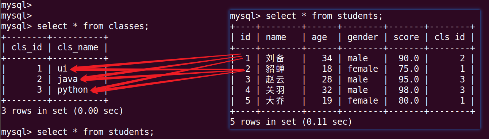

原理分析：

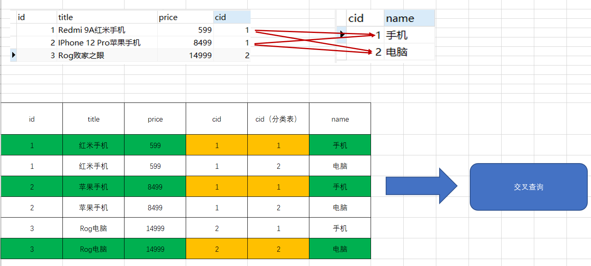

## 1、内连接

### ☆ 连接查询的介绍

连接查询可以实现多个表的查询，当查询的字段数据来自不同的表就可以使用连接查询来完成。

连接查询可以分为:

1. 内连接查询
2. 左连接查询
3. 右连接查询
4. 自连接查询

### ☆ 内连接查询

查询两个表中符合条件的共有记录


**内连接查询语法格式:**

```sql
select 字段 from 表1 inner join 表2 on 表1.字段1 = 表2.字段2
```

**说明:**

- inner join 就是内连接查询关键字
- on 就是连接查询条件

**例1：使用内连接查询学生表与班级表:**

```sql
select * from students as s inner join classes as c on s.cls_id = c.id;
```

### ☆ 小结

- 内连接使用inner join .. on .., on 表示两个表的连接查询条件
- 内连接根据连接查询条件取出两个表的 “交集”

## 2、左外连接

### ☆ 左连接查询

以左表为主根据条件查询右表数据，如果根据条件查询右表数据不存在使用null值填充


**左连接查询语法格式:**

```sql
select 字段 from 表1 left join 表2 on 表1.字段1 = 表2.字段2
```

**说明:**

- left join 就是左连接查询关键字
- on 就是连接查询条件
- 表1 是左表
- 表2 是右表

**例1：使用左连接查询学生表与班级表:**

```sql
select * from students as s left join classes as c on s.cls_id = c.id;
```

### ☆ 小结

- 左连接使用left join .. on .., on 表示两个表的连接查询条件
- 左连接以左表为主根据条件查询右表数据，右表数据不存在使用null值填充。

## 3、右外连接

### ☆ 右连接查询

以右表为主根据条件查询左表数据，如果根据条件查询左表数据不存在使用null值填充


**右连接查询语法格式:**

```sql
select 字段 from 表1 right join 表2 on 表1.字段1 = 表2.字段2
```

**说明:**

- right join 就是右连接查询关键字
- on 就是连接查询条件
- 表1 是左表
- 表2 是右表

**例1：使用右连接查询学生表与班级表:**

```sql
select * from students as s right join classes as c on s.cls_id = c.id;
```

### ☆ 小结

- 右连接使用right join .. on .., on 表示两个表的连接查询条件
- 右连接以右表为主根据条件查询左表数据，左表数据不存在使用null值填充。

## 4、自连接查询

### ☆ 自连接查询

左表和右表是同一个表，根据连接查询条件查询两个表中的数据。

地域：area

pid 全称 parent id（父级ID编号）


**例1：查询省的名称为“山西省”的所有城市**

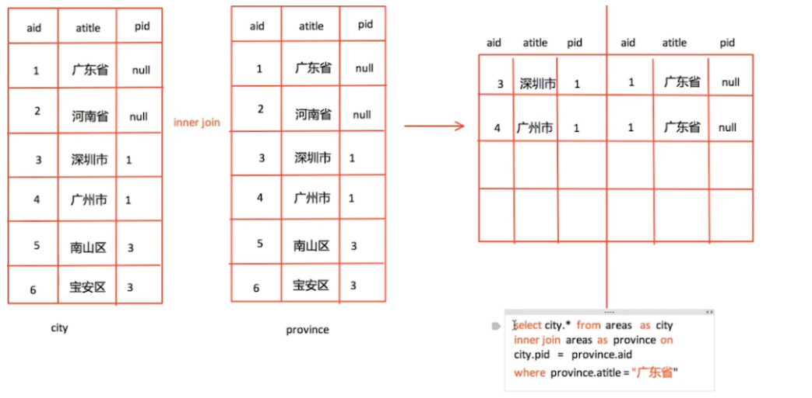

**创建areas表:**

```sql
use db_itheima;
create table areas(
    id varchar(30) not null primary key, 
    title varchar(30), 
    pid varchar(30)
) default charset=utf8;
```

**执行sql文件给areas表导入数据:**

```sql
mysql> source /home/ubuntu/Desktop/areas.sql
```

**说明:**

- source 表示执行的sql文件

**自连接查询的用法:**

```sql
select c.id, c.title, c.pid, p.title from areas as c inner join areas as p on c.pid = p.id where p.title = '山西省';
```

**说明:**

- 自连接查询必须对表起别名

### ☆ 小结

- 自连接查询就是把一张表模拟成左右两张表，然后进行连表查询。
- 自连接就是一种特殊的连接方式，连接的表还是本身这张表

# 七、子查询(三步走)

## 1、子查询（嵌套查询）的介绍

在一个 select 语句中,嵌入了另外一个 select 语句, 那么被嵌入的 select 语句称之为子查询语句，外部那个select语句则称为主查询.

**主查询和子查询的关系:**

1. 子查询是嵌入到主查询中
2. 子查询是辅助主查询的,要么充当条件,要么充当数据源(数据表)
3. 子查询是可以独立存在的语句,是一条完整的 select 语句

## 2、子查询的使用

**例1. 查询学生表中大于平均年龄的所有学生:**

需求：查询年龄 > 平均年龄的所有学生

前提：① 获取班级的平均年龄值

​			  ② 查询表中的所有记录，判断哪个同学 > 平均年龄值

第一步：写子查询

```powershell
select avg(age) from students;
```

第二步：写主查询
```powershell
select * from students where age > (平均值);
```

第三步：第一步和第二步进行合并

```powershell
select * from students where age > (select avg(age) from students);
```


**例2. 查询学生在班的所有班级名字:**

需求：显示所有有学生的班级名称

前提：① 先获取所有学员都属于那些班级

​	         ② 查询班级表中的所有记录，判断是否出现在①结果中，如果在，则显示，不在，则忽略。

第一步：编写子查询

```powershell
select distinct cls_id from students is not null;
```

第二步：编写主查询

```powershell
select * from classes where cls_id in (1, 2, 3);
```

第三步：把主查询和子查询合并

```sql
select * from classes where cls_id in (select distinct cls_id from students where cls_id is not null);
```


**例3. 查找年龄最小,成绩最低的学生:**

第一步：获取年龄最小值和成绩最小值

```powershell
select min(age), min(score) from student;
```

第二步：查询所有学员信息（主查询）

```sql
select * from students where (age, score) = (最小年龄, 最少成绩);
```

第三步：把第一步和第二步合并

```powershell
select * from students where (age, score) = (select min(age), min(score) from students);
```


## 3、小结

- 子查询是一个完整的SQL语句，子查询被嵌入到一对小括号里面

# 八、数据库设计三范式（了解）

## 1、数据库设计之三范式的介绍

范式: 对设计数据库提出的一些规范，目前有迹可寻的共有8种范式，一般遵守3范式即可。

- 第一范式（1NF）: 强调的是列的==原子性==，即列不能够再分成其他几列。
- 第二范式（2NF）: 满足 1NF，另外包含两部分内容，一是表必须有==一个主键==；二是==非主键字段 必须完全依赖于主键，而不能只依赖于主键的一部分==。（一个表中只能有一类数据）
- 第三范式（3NF）: 满足 2NF，另外==非主键列必须直接依赖于主键，不能存在传递依赖==。即不能存在：非主键列 A 依赖于非主键列 B，非主键列 B 依赖于主键的情况。（非主键字段必须直接依赖主键）

## 2、第一范式的介绍

**如图所示的表结构:**

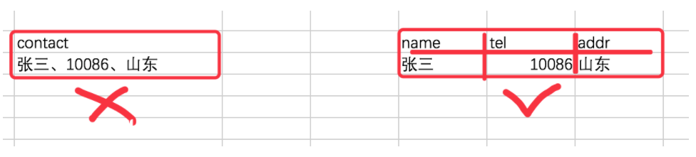

**说明:**

- 这种表结构设计就没有达到 1NF，要符合 1NF 我们只需把列拆分，即：把 contact 字段拆分成 name 、tel、addr 等字段。

## 3、第二范式的介绍

**如图所示的表结构:**

==每个表你都可以理解为一个对象，但是下面的表里面有两个对象（订单对象、产品对象）==

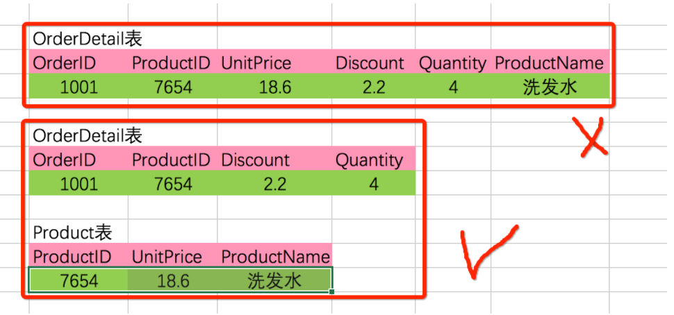

**说明:**

- 这种表结构设计就没有达到 2NF，因为 Discount（折扣），Quantity（数量）完全依赖于主键（OrderID），而 UnitPrice单价，ProductName产品名称 只依赖于 ProductID, 所以 OrderDetail 表不符合 2NF。
- 我们可以把【OrderDetail】表拆分为【OrderDetail】（OrderID，ProductID，Discount，Quantity）和【Product】（ProductID，UnitPrice，ProductName）这样就符合第二范式了。

## 4、第三范式的介绍

**如图所示的表结构:**

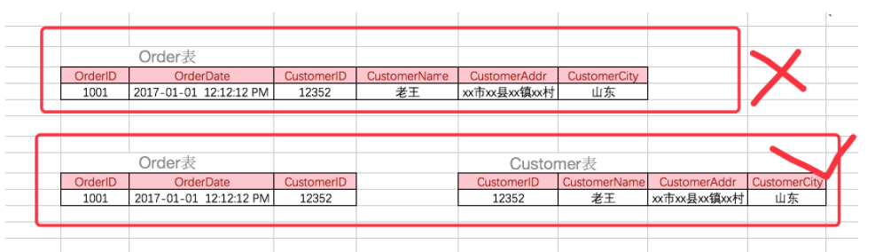

**说明:**

- 这种表结构设计就没有达到 3NF，因为 OrderDate，CustomerID，CustomerName，CustomerAddr，CustomerCity 等非主键列都完全依赖于主键（OrderID），所以符合 2NF。不过问题是 CustomerName，CustomerAddr，CustomerCity 直接依赖的是 CustomerID（非主键列），而不是直接依赖于主键，它是通过传递才依赖于主键，所以不符合 3NF。
- 我们可以把【Order】表拆分为【Order】（OrderID，OrderDate，CustomerID）和【Customer】（CustomerID，CustomerName，CustomerAddr，CustomerCity）从而达到 3NF。

## 5、E-R模型的介绍

E-R模型即实体-关系模型，E-R模型就是描述数据库存储数据的结构模型。

**E-R模型的使用场景:**

1. 对于大型公司开发项目，我们需要根据产品经理的设计，我们先使用建模工具, 如:power designer，db desinger等这些软件来画出实体-关系模型(E-R模型)
2. 然后根据三范式设计数据库表结构

**E-R模型的效果图:**

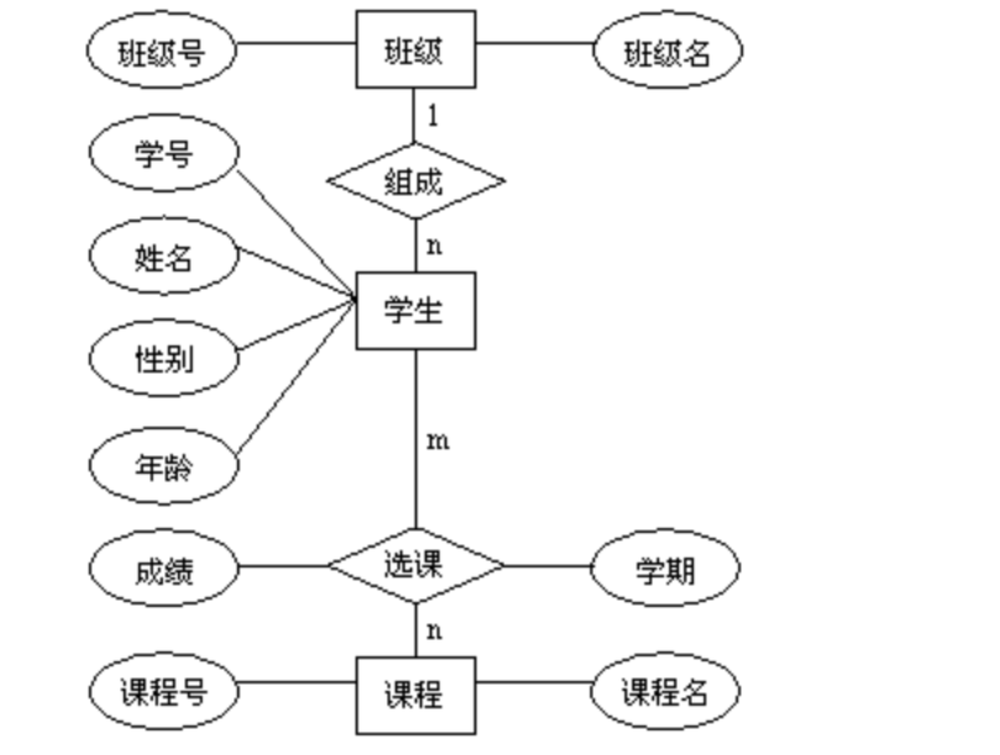

**说明:**

- 实体: 用矩形表示，并标注实体名称
- 属性: 用椭圆表示，并标注属性名称，
- 关系: 用菱形表示，并标注关系名称
  - 一对一
  - 一对多
  - 多对多

**一对一的关系:**


**说明:**

- 关系也是一种数据，需要通过一个字段存储在表中
- 1对1关系，在表A或表B中创建一个字段，存储另一个表的主键值

**一对多的关系:**

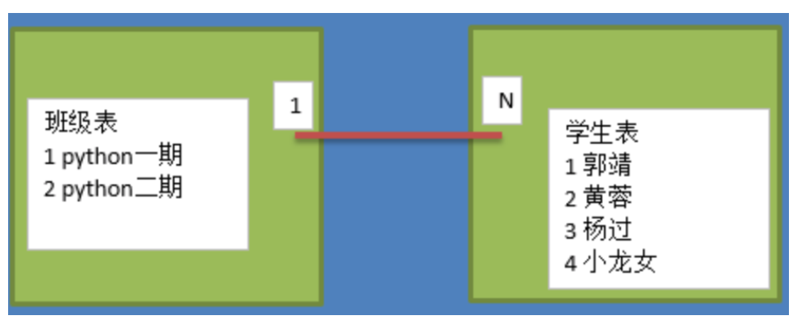

**说明:**

- 1对多关系，在多的一方表(学生表)中创建一个字段，存储班级表的主键值

**多对多的关系:**

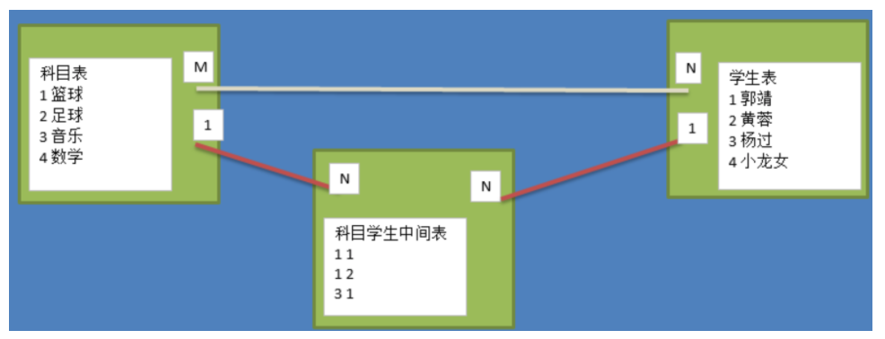

**说明:**

- 多对多关系，新建一张表C，这个表只有两个字段，一个用于存储A的主键值，一个用于存储B的主键值

> 如果在实际项目开发中，遇到了两张表关联时，如果出现了多对多关系，则必须创建中间表。中间表一般只保留两个表的主键。

## 5、小结

- 范式就是设计数据库的一些通用规范。
  - 1NF强调字段是最小单元，不可再分
  - 2NF强调在1NF基础上必须要有主键和非主键字段必须完全依赖主键，也就是说不能部分依赖
  - 3MF强调在2NF基础上 非主键字段必须直接依赖于主键，也就是说不能传递依赖(间接依赖)。
- E-R模型由 实体、属性、实体之间的关系构成，主要用来描述数据库中表结构。
- 开发流程是先画出E-R模型，然后根据三范式设计数据库中的表结构

# 九、外键（扩展）

主键：primary key

外键：foreign key（应用场景：在两表或多表关联的时候设置的，用于标志两个表之间的联系）

## 1、外键约束作用

外键约束:对外键字段的值进行更新和插入时会和引用表中字段的数据进行验证，数据如果不合法则更新和插入会失败，保证数据的有效性。

dage表：

| id编号（主键） | name姓名 |
| -------------- | -------- |
| 1              | 陈浩南   |
| 2              | 乌鸦哥   |

xiaodi表：

| id编号 | name姓名   | dage_id（外键） |
| ------ | ---------- | --------------- |
| 1      | 山鸡       | 1               |
| 2      | 大天二     | 1               |
| 3      | 乌鸦的小弟 | 2               |

> 外键设计原则：保证两张表的关联关系，保证数据的一致性。在选择时，一般在一个表中时关联字段，在另外一个表中是主键，则这个字段建议设置为外键。

## 2、对于已经存在的字段添加外键约束

```sql
-- 为cls_id字段添加外键约束
alter table students add foreign key(cls_id) references classes(id) 
[on delete cascade| set null] [on update cascade | ];
```

## 3、在创建数据表时设置外键约束

```sql
-- 创建学校表
create table school(
    id int not null primary key auto_increment, 
    name varchar(10)
);

-- 创建老师表
create table teacher(
    id int not null primary key auto_increment, 
    name varchar(10), 
    s_id int not null, 
    foreign key(s_id) references school(id)
);
```

## 4、删除外键约束

```sql
-- 需要先获取外键约束名称,该名称系统会自动生成,可以通过查看表创建语句来获取名称
show create table teacher;

-- 获取名称之后就可以根据名称来删除外键约束
alter table teacher drop foreign key 外键名;
```

> 注：SET FOREIGN_KEY_CHECKS=0外键检查

## 5、小结

- 添加外键约束: alter table 从表 add foreign key(外键字段) references 主表(主键字段);
- 删除外键约束: alter table 表名 drop foreign key 外键名;

# 十、练习

## 1、数据准备

```sql
-- 创建 "京东" 数据库
create database jing_dong charset=utf8;

-- 使用 "京东" 数据库
use jing_dong;

-- 创建一个商品goods数据表
create table goods(
    id int unsigned primary key auto_increment not null,
    name varchar(150) not null,
    cate_name varchar(40) not null,
    brand_name varchar(40) not null,
    price decimal(10,3) not null default 0,
    is_show bit not null default 1,
    is_saleoff bit not null default 0
);

-- 向goods表中插入数据

insert into goods values(0,'r510vc 15.6英寸笔记本','笔记本','华硕','3399',default,default); 
insert into goods values(0,'y400n 14.0英寸笔记本电脑','笔记本','联想','4999',default,default);
insert into goods values(0,'g150th 15.6英寸游戏本','游戏本','雷神','8499',default,default); 
insert into goods values(0,'x550cc 15.6英寸笔记本','笔记本','华硕','2799',default,default); 
insert into goods values(0,'x240 超极本','超级本','联想','4880',default,default); 
insert into goods values(0,'u330p 13.3英寸超极本','超级本','联想','4299',default,default); 
insert into goods values(0,'svp13226scb 触控超极本','超级本','索尼','7999',default,default); 
insert into goods values(0,'ipad mini 7.9英寸平板电脑','平板电脑','苹果','1998',default,default);
insert into goods values(0,'ipad air 9.7英寸平板电脑','平板电脑','苹果','3388',default,default); 
insert into goods values(0,'ipad mini 配备 retina 显示屏','平板电脑','苹果','2788',default,default); 
insert into goods values(0,'ideacentre c340 20英寸一体电脑 ','台式机','联想','3499',default,default); 
insert into goods values(0,'vostro 3800-r1206 台式电脑','台式机','戴尔','2899',default,default); 
insert into goods values(0,'imac me086ch/a 21.5英寸一体电脑','台式机','苹果','9188',default,default); 
insert into goods values(0,'at7-7414lp 台式电脑 linux ）','台式机','宏碁','3699',default,default); 
insert into goods values(0,'z220sff f4f06pa工作站','服务器/工作站','惠普','4288',default,default); 
insert into goods values(0,'poweredge ii服务器','服务器/工作站','戴尔','5388',default,default); 
insert into goods values(0,'mac pro专业级台式电脑','服务器/工作站','苹果','28888',default,default); 
insert into goods values(0,'hmz-t3w 头戴显示设备','笔记本配件','索尼','6999',default,default); 
insert into goods values(0,'商务双肩背包','笔记本配件','索尼','99',default,default); 
insert into goods values(0,'x3250 m4机架式服务器','服务器/工作站','ibm','6888',default,default); 
insert into goods values(0,'商务双肩背包','笔记本配件','索尼','99',default,default);
```

**表结构说明:**

- id 表示主键 自增
- name 表示商品名称
- cate_name 表示分类名称
- brand_name 表示品牌名称
- price 表示价格
- is_show 表示是否显示
- is_saleoff 表示是否售完

## 2、SQL语句演练

1. 查询类型cate_name为 '超级本' 的商品名称、价格

   ```sql
   
   ```

2. 显示商品的分类

   ```sql
   
   ```

3. 求所有电脑产品的平均价格,并且保留两位小数

   ```sql
    
   ```

4. 显示每种商品的平均价格

   ```sql
   
   ```

5. 查询每种类型的商品中 最贵、最便宜、平均价、数量

   ```sql
    
   ```
   
6. 查询所有价格大于平均价格的商品，并且按价格降序排序

   ```sql
   
   ```